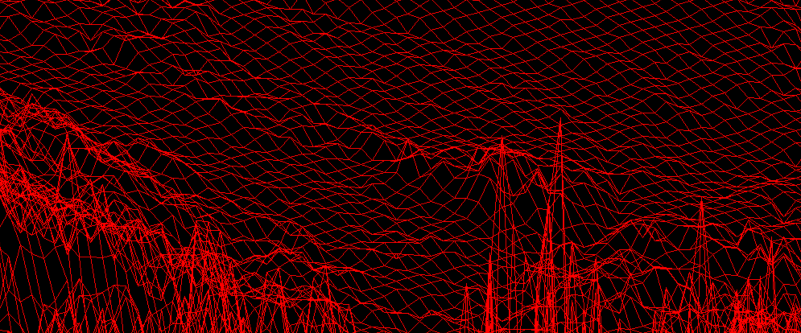

# FDF
Fil de fer



## Principe

Le programme fdf doit pouvoir générer graphiquement une projection isométrique d'une terrain en relief en reliant des points le composant. Pour cela l'utilisateur doit entrer une carte.fdf formatée comme selon :

> Où les valeurs données correspondent à l'altitude (axe z).

Pour executer :
```bash
$> make
$> ./fdf test_maps/france.fdf
```

## Fonctionnement

:construction_worker_man: En travaux :construction_worker_woman:

## Difficultés rencontrées

:construction_worker_man: En travaux :construction_worker_woman:
utilisation de la minilibX

## Documentation utilisée

Articles
- [Start minilibX with Aurelien Brabant](https://aurelienbrabant.fr/blog/getting-started-with-the-minilibx)

Videos
- [Une heure de bresenham pour bien comprendre](https://www.youtube.com/watch?v=nQbnYl7xgb8)


